<!-- Banner -->
<div align="center">
  
</div>

<!-- Intro -->
<h1 align="center">Hey, I'm Saurabh </h1>

<p align="center">
  <a href="https://git.io/typing-svg">
    
  </a>
</p>

<p align="center">
  
</p>

<!-- Animated contribution snake — generated automatically by the workflow in .github/workflows/snake.yml -->
<div align="center">
  
</div>

---

## 🧠 About Me

```python
class Saurabh:
    def __init__(self):
        self.role = "AI/ML Enthusiast | B.Tech CSE Student"
        self.university = "Arka Jain University, Jharkhand"
        self.stack = ["Python", "SQL", "Pandas", "NumPy", "Scikit-learn"]
        self.currently_learning = ["PyTorch", "Deep Learning", "MLOps"]
        self.experience = "6+ months teaching Python & coding fundamentals"
        self.fun_fact = "I debug models the way I debug life — one epoch at a time 😄"
        self.open_to_work = True

    def say_hi(self):
        print("Let's build something intelligent together 🚀")

me = Saurabh()
me.say_hi()
```

- 🎓 5th Semester, B.Tech CSE (AI/ML Specialization)
- 🔍 Deep diving into **Machine Learning**, **Data Analytics** & **Model Building**
- 👨‍🏫 Coding instructor experience — turning "I don't get it" into "I got it!"
- 📊 Comfortable with the full pipeline: clean data → EDA → model → insight
- ⚡ Currently grinding DSA + ML Specialization side by side
- 💬 Ask me about **Python, SQL, Power BI, ML fundamentals, or data storytelling**

---

## 🛠 Tech Stack

**Languages & Core**


**AI / ML & Data**


**Visualization & Tools**


<div align="center">
  
</div>

---

## 🧬 Neural Pathways (What I'm Learning)

```mermaid
graph LR
    A[Python Foundations] --> B[Data Analytics]
    B --> C[SQL & Power BI]
    C --> D[Machine Learning]
    D --> E[Deep Learning / PyTorch]
    E --> F[Deployed AI Projects 🚀]

    style A fill:#0f2027,stroke:#00E5A0,color:#fff
    style B fill:#0f2027,stroke:#00E5A0,color:#fff
    style C fill:#0f2027,stroke:#00E5A0,color:#fff
    style D fill:#0f2027,stroke:#00E5A0,color:#fff
    style E fill:#0f2027,stroke:#00E5A0,color:#fff
    style F fill:#00c9a7,stroke:#00E5A0,color:#000
```

<div align="center">



</div>

---

<div align="center">
  
</div>

## 📊 GitHub Stats

<div align="center">
  
  
</div>

<div align="center">
  
</div>

<div align="center">
  
</div>

---

## 🧊 Isometric Contribution Calendar

<div align="center">
  
</div>

---

## 🏆 GitHub Trophies

<div align="center">
  
</div>

---

---

## 🧬 Profile Summary

<div align="center">
  
  
</div>
<div align="center">
  
  
</div>

---

## 🎯 Currently Building Toward

- ✅ Strong DSA fundamentals (Blind 75 / NeetCode 150)
- ✅ ML Specialization (Andrew Ng) → PyTorch deep dive
- 🎯 End-to-end deployed ML projects for portfolio
- 🎯 Internship at an AI/ML-focused startup

---

<div align="center">
  
</div>

## 🤝 Connect With Me

<div align="center">
  <a href="https://linkedin.com/in/YOUR_LINKEDIN">
    
  </a>
  <a href="https://twitter.com/YOUR_TWITTER">
    
  </a>
  <a href="mailto:YOUR_EMAIL">
    
  </a>
  <a href="https://YOUR_PORTFOLIO">
    
  </a>
</div>

---

<div align="center">
  
  <br/><br/>
  <i>"In machine learning, as in life — the model improves with every iteration."</i>
  <br/><br/>
  
</div>
